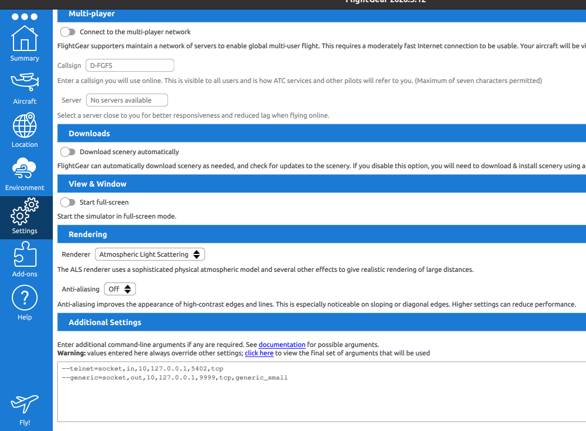
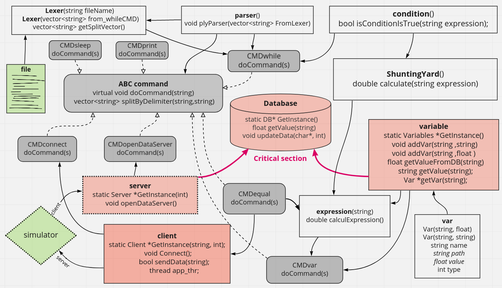

Filhtgear project
----
In this program I created an interpreter to run a flight simulator using a text file, the program is a client
and server for the simulator, which sends commands to the simulator and receives 36 real-time data 
on the aircraft status (every 10 times per second) and these values ​​are stored in the program database (other 
objects will use it)

Download the simulator from the link [flightgear](https://www.flightgear.org).

Then, in the additional settings section write the following lines:

--telnet = socket, in, 10,127.0.0.1,5402, tcp

--generic = socket, out, 10,127.0.0.1,5400, tcp, generic_small (see picture()

I added an xml file Insert it into the protocol folder in the installation folder
In the order of the variables so (in the same order) the simulator's server
 will send to the client you define

in addition a text file (according to which the commands will be determined) of course you can change it
You have a makfile ---> then you just run the ./main file

# FG
